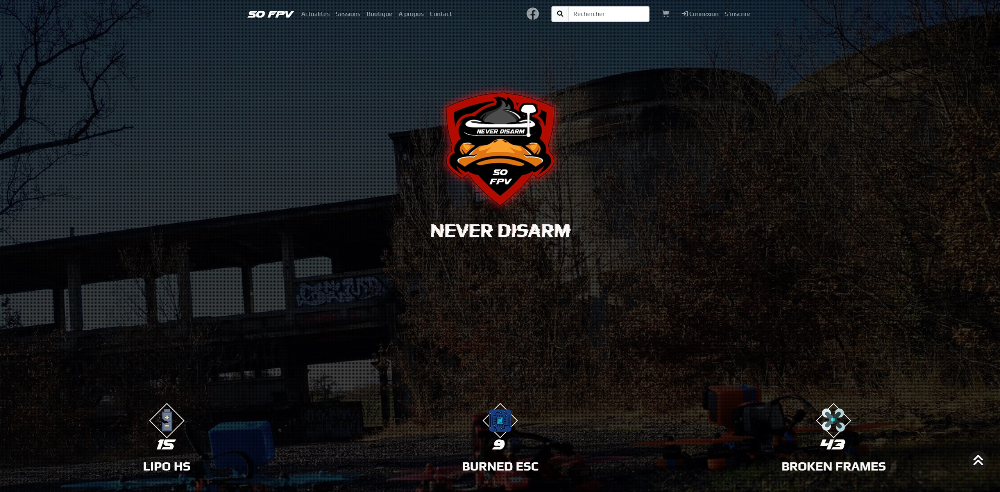

# :small_airplane: SO FPV 
Version : 1.0  
	:link: [SO FPV](https://www.sofpv.lauragaupin.fr/)

 

## :information_source: Description
- FR: Site communautaire pour l'association SO FPV , qui regroupe les passionnés de **drones FPV** dans le sud-ouest de la France.
- EN: Community website for the SO FPV association , which brings together FPV drone enthusiasts in southwestern France.

## ⚙️ Technologies used 
Symfony 7, Twig 3, Javascript, PHP 8.1, Sass, Bootstrap, Stripe, Composer, MapLibre

## :clipboard: Features
:heavy_check_mark: Blog publications (text, videos and pictures) with comments, likes and report features (to help moderation)  
:heavy_check_mark: Map with flight sessions organizer  
:heavy_check_mark: *Dummy* e-shop with little catalog, stock gestion, cart and order features *(Stripe payment on TEST only)*  
:heavy_check_mark: "About" page, with some association's and hobby's infos  
:heavy_check_mark: Contact page with contact form (send a message on admin mail and on admin's dashboard )  
:heavy_check_mark: Register, Login and Logout  
:heavy_check_mark: Public profile : public info of the user, his subscribed sessions, his blog publications  
:heavy_check_mark: Personnal profile : user info gestion, stats and sessions', orders' and publications' gestion  
:heavy_check_mark: Admin part with general data's CRUD, response to a mail, moderation features  

## :keyboard: Developper
Laura Gaupin

## :balance_scale: Licence
Licence: GNU General Public License V3 or later
Licence URI : https://www.gnu.org/licenses/gpl-3.0.html
